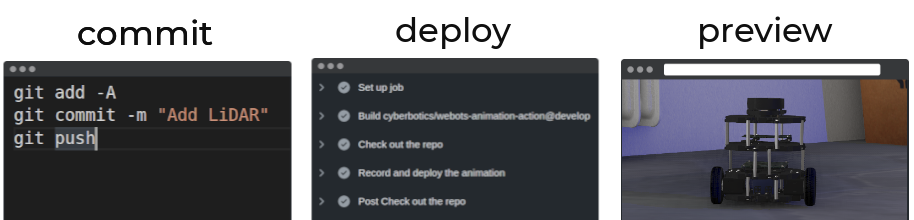

# Webots Animation Action

This GitHub action creates a Webots animation of a simulation and publishes it to GitHub pages.

<p align="center">
  
</p>


After each commit, Webots simulation will be recorded and published to `<username>.github.io/<repository>` as an X3D animation.
In your browser, you can move around and zoom while the animation is playing.

## Workflow

Here is a simple GitHub workflow snippet which utilizes the action:
```yaml
name: Record animation

on:
  push:
    branches: 
      - master

jobs:
  record:
    runs-on: ubuntu-latest
    steps:
      - name: Check out the repo
        uses: actions/checkout@v2
      - name: Record and deploy the animation
        uses: cyberbotics/webots-animation-action@master
```
> You can save the snippet to e.g.: `.github/workflows/record_animation.yml`.

## Configuration

You can create `webots.yaml` configuration file in the root of your repository to fine tune generated animations.
If the file is not present, the action will automatically generate animations for all files according to the default configuration.

```yaml
animation:
  worlds:
    - file: worlds/tutorial_6.wbt
      duration: 5
    - file: worlds/tutorial_1.wbt
      duration: 10
```

The world options are:

| **name**   | **description**                             |
|------------|---------------------------------------------|
| `file`     | Path to world file (.wbt)                   |
| `duration` | Animation duration in seconds (default 10s) |

## Examples

Check out [Webots Animation Template](https://github.com/cyberbotics/webots-animation-template/) repository.
